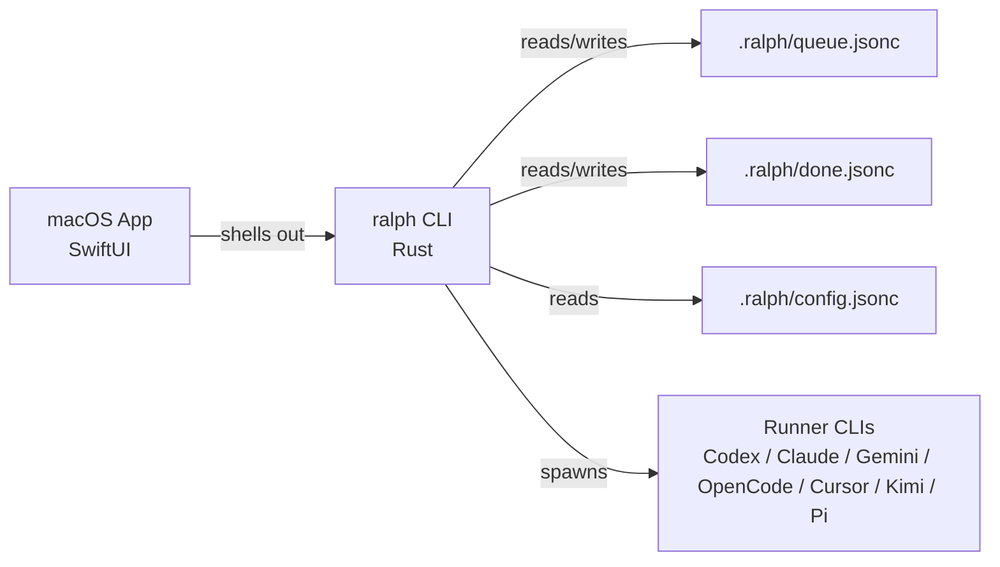

# Ralph

Ralph is a Rust CLI for running AI agent loops against a structured JSON task queue.


## Why This Project

Ralph demonstrates practical AI-agent orchestration for real software work:

- Structured task queue with explicit lifecycle, dependencies, and auditability
- Multi-runner execution (`codex`, `opencode`, `gemini`, `claude`, `cursor`, `kimi`, `pi`)
- Multi-phase supervision workflow (plan, implement, review)
- Parallel execution model with workspace isolation and direct-push integration
- Built-in safety rails (sanity checks, CI gating, retries, session recovery, undo snapshots)

## Core Capabilities

- Queue operations: validate, search, graph, tree, archive, repair, import/export
- Task operations: create/build, edit, clone, split, relate, schedule, batch updates
- Run supervision: `run one`, `run loop`, `run resume`, `run parallel status/retry`
- Prompt tooling: inspect/export/sync embedded prompts
- Integrations: plugins, webhooks, notifications, daemon/watch automation, macOS app bridge
- Operational visibility: doctor diagnostics, runner capabilities, productivity analytics

## Architecture



## Install

From crates.io:

```bash
cargo install ralph
```

From source:

```bash
git clone https://github.com/mitchfultz/ralph
cd ralph
make install
```

## Quick Start

```bash
# 1) Initialize a repository
ralph init

# 2) Add a task
ralph task "Stabilize flaky queue integration test"

# 3) Execute one task
ralph run one

# 4) Inspect queue state
ralph queue list
```

### Reviewer Quickstart (No AI runner required)

Use queue and graph commands to evaluate behavior without configuring external runner CLIs:

```bash
ralph init
ralph task "Create an initial queue item"
ralph queue list
ralph queue graph
ralph queue validate
ralph doctor
```

macOS app (optional):

```bash
ralph app open
```

## Workflow Model

Ralph supports three execution shapes:

- `--phases 1` (or `--quick`): single-pass execution
- `--phases 2`: plan + implement
- `--phases 3` (default): plan + implement + review

Phase-specific runner/model overrides are supported with:

- `--runner-phase1/2/3`
- `--model-phase1/2/3`
- `--effort-phase1/2/3`

## Configuration

Configuration precedence:

1. CLI flags
2. Project config: `.ralph/config.jsonc` (`.json` fallback)
3. Global config: `~/.config/ralph/config.jsonc` (`.json` fallback)
4. Schema defaults

Minimal project config example:

```jsonc
{
  "version": 1,
  "agent": {
    "runner": "claude",
    "model": "sonnet",
    "phases": 3
  }
}
```

## Screenshots

CLI workflow sample:


## Documentation

Start here:

- [Documentation Index](docs/index.md)
- [Quick Start](docs/quick-start.md)
- [CLI Reference](docs/cli.md)
- [Configuration](docs/configuration.md)
- [Portfolio / Reviewer Guide](PORTFOLIO.md)
- [Public Readiness Checklist](docs/guides/public-readiness.md)

Reference and policies:

- [CONTRIBUTING.md](CONTRIBUTING.md)
- [SECURITY.md](SECURITY.md)
- [CHANGELOG.md](CHANGELOG.md)

## Development

```bash
# fast local checks
make agent-ci

# full ship gate (includes macOS app checks)
make macos-ci
```

## License

MIT
