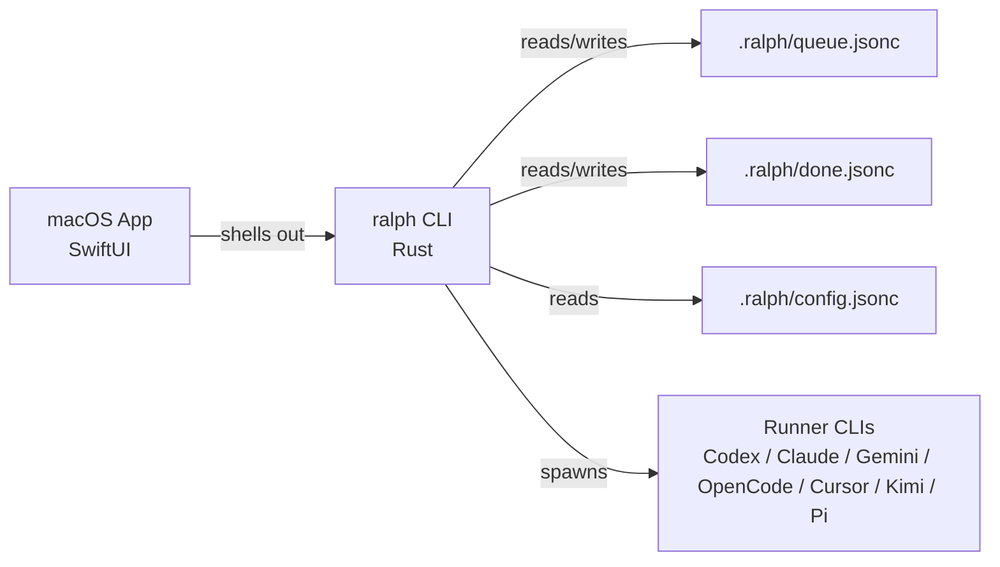

# Ralph

Ralph is a Rust CLI that runs AI-agent work loops against a structured task queue stored in your repository.

Teams use Ralph when ad-hoc AI coding stops being enough and they need a repeatable way to turn requests into queued work, run that work through Codex/Claude/Gemini-style agents, and keep the result reviewable with local files, local CI, and explicit task history instead of hidden SaaS state.


## What Ralph Is For

Ralph is designed for engineering teams that want repeatable, auditable AI-assisted development workflows.

It provides:

- A structured task queue with explicit lifecycle and dependency links
- Multi-runner execution (`codex`, `opencode`, `gemini`, `claude`, `cursor`, `kimi`, `pi`)
- Supervised 1/2/3-phase execution (plan, implement, review)
- Parallel execution with workspace isolation
- Guardrails around queue validity, retries, session recovery, and local CI gates

### Non-goals

- Hosted SaaS orchestration (Ralph is local-first)
- Hidden black-box state (queue and done files are plain JSONC in `.ralph/`)
- Replacing your existing developer tooling; Ralph integrates with it

## Architecture at a Glance



## Install

From crates.io:

```bash
cargo install ralph
```

From source:

> GNU Make >= 4 is required for project targets. On macOS, install via `brew install make` and use `gmake` unless GNU Make is already your default `make`.

```bash
git clone https://github.com/mitchfultz/ralph
cd ralph
make install
# macOS/Homebrew GNU Make users: gmake install
```

## Supported Platforms & Toolchain

- Supported OS: macOS and Linux
- Rust toolchain: pinned by `rust-toolchain.toml` (for deterministic fmt/clippy/test behavior)
- SwiftUI app: macOS only (`apps/RalphMac/`)

## Quick Start

```bash
# 1) Initialize in your repo
ralph init

# 2) Add a task
ralph task "Stabilize flaky queue integration test"

# 3) Execute one task
ralph run one

# 4) Inspect queue state
ralph queue list
```

## End-to-End Example

Here is a concrete repo workflow for a team using Codex or Claude Code in a normal feature branch:

```bash
# install Ralph in your application repo
cargo install ralph
cd your-service
ralph init

# turn a real request into queued work
ralph task "Add retry coverage for webhook delivery failures"

# inspect the task Ralph just created
ralph queue list
ralph queue show RQ-0001

# let your configured runner plan, implement, and review the task
ralph run one --phases 3

# verify the repo is still healthy and the task moved forward
ralph queue list
ralph doctor
```

What this gives the team: one tracked queue, one explicit task lifecycle, one local verification path, and the flexibility to swap runners without changing the repo workflow.

## Public Reviewer Smoke Test (5 minutes)

No external runner setup required:

```bash
ralph init
ralph --help
ralph run one --help
ralph scan --help
ralph queue list
ralph queue graph
ralph queue validate
ralph doctor
make agent-ci
```

Expected signals:

- Help and queue commands succeed
- `ralph doctor` exits successfully
- `make agent-ci` completes with passing format/type/lint/test checks

Full scripted version: [docs/guides/reviewer-smoke-test.md](docs/guides/reviewer-smoke-test.md)

## Security & Data Handling

Ralph is local-first, but selected runner CLIs may transmit prompts/context to external APIs depending on your runner configuration.

- Do not place secrets in task text, notes, or tracked config
- Keep runtime artifacts local (`.ralph/cache/`, `.ralph/logs/`, `.ralph/workspaces/`, `.ralph/undo/`, `.ralph/webhooks/`)
- Use `make pre-public-check` before public release windows

Security references:

- [SECURITY.md](SECURITY.md)
- [Security Model](docs/security-model.md)

## Known Limitations

- Quality/speed depend on selected runner model and prompts
- UI tests are intentionally not part of default `make macos-ci` (headed interaction)
- Parallel execution introduces additional branch/workspace complexity in very large repos

## Versioning & Compatibility

Ralph follows semantic versioning.

- Minor/patch releases preserve existing behavior unless explicitly documented
- Breaking CLI/config behavior changes are called out in changelog and migration notes

Details: [docs/versioning-policy.md](docs/versioning-policy.md)

## Documentation

Start here:

- [Documentation Index](docs/index.md)
- [Architecture Overview](docs/architecture.md)
- [Quick Start](docs/quick-start.md)
- [Reviewer Smoke Test](docs/guides/reviewer-smoke-test.md)
- [CLI Reference](docs/cli.md)
- [Configuration](docs/configuration.md)
- [Troubleshooting](docs/troubleshooting.md)
- [CI and Test Strategy](docs/guides/ci-strategy.md)
- [Public Readiness Checklist](docs/guides/public-readiness.md)
- [Portfolio / Reviewer Guide](PORTFOLIO.md)

Policies:

- [CONTRIBUTING.md](CONTRIBUTING.md)
- [CODE_OF_CONDUCT.md](CODE_OF_CONDUCT.md)
- [SECURITY.md](SECURITY.md)
- [CHANGELOG.md](CHANGELOG.md)

## Repository Runtime State

This repository intentionally keeps a small sanitized `.ralph/` state for reproducible examples.
In most consumer repositories, `.ralph/` is project-local runtime state managed by `ralph init`.

## Development

```bash
# Fast deterministic Rust/CLI checks
make ci-fast

# Path-aware gate (auto-escalates to macOS checks when app paths changed)
make agent-ci

# Full Rust release gate
make ci

# Full ship gate (includes macOS app checks)
make macos-ci

# Public-readiness audit
make pre-public-check
```

## License

MIT
