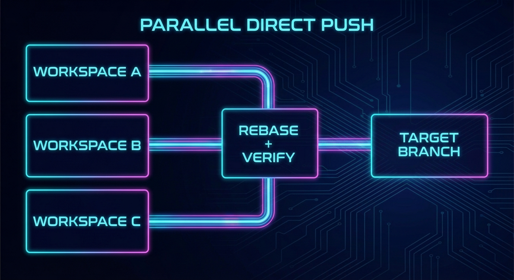

# Ralph Parallel Execution (Experimental Direct-Push Mode)
Status: Active
Owner: Maintainers
Source of truth: this document for its stated scope
Parent: [Feature Documentation](README.md)




Parallel execution runs multiple tasks concurrently in isolated git workspace clones, with workers pushing directly to the target branch.

> **Experimental**: Direct-push parallel execution is a power-user feature with higher branch-safety risk than sequential runs. It stays opt-in and should not be the default onboarding path.

> **CLI Only**: Parallel execution is available only via CLI (`ralph run loop --parallel [N]`).

---

## Table of Contents

1. [Overview](#overview)
2. [Architecture](#architecture)
3. [Workspace Management](#workspace-management)
4. [Integration Loop](#integration-loop)
5. [Configuration](#configuration)
6. [State Management](#state-management)
7. [Operations Commands](#operations-commands)
8. [Limitations](#limitations)
9. [Workflow](#workflow)
10. [Monitoring](#monitoring)

---

## Overview

### What is Parallel Execution?

Parallel execution enables Ralph to process multiple queue tasks simultaneously by:

- Running each task in its own isolated git workspace clone
- Executing configured phases for each task independently
- Running an integration loop (fetch, rebase, resolve conflicts, CI gate, push)
- Pushing completed work directly to the target branch
- Tracking worker state for crash recovery and coordination

### When to Use Parallel Execution

| Use Case | Recommendation |
|----------|---------------|
| Multiple independent tasks | ✅ Ideal for parallel execution |
| Tasks with no dependencies | ✅ Parallel execution works well |
| Tasks requiring rapid completion | ✅ Significantly faster than sequential |
| Tasks requiring careful review | ⚠️ Use sequential mode or manual review |
| Tasks with heavy resource usage | ⚠️ Adjust `workers` to avoid overload |
| Tasks with complex interdependencies | ❌ Use sequential mode instead |

### Basic Usage

```bash
# Run with default settings (2 workers)
ralph run loop --parallel

# Run with specific number of workers
ralph run loop --parallel 4

# Run with max tasks limit
ralph run loop --parallel 3 --max-tasks 10

# Check parallel worker status
ralph run parallel status

# Retry a blocked worker
ralph run parallel retry --task RQ-0001
```

Before enabling it, confirm that:

- your branch policy allows direct pushes from automation
- your repo can tolerate concurrent workspace clones and repeated rebase/push attempts
- you have intentionally selected a publish mode that matches that risk

---

## Architecture

### High-Level Architecture

```
┌─────────────────────────────────────────────────────────────────┐
│                     Parallel Coordinator                         │
│                    (Main ralph process)                          │
├─────────────────────────────────────────────────────────────────┤
│  ┌─────────────┐  ┌─────────────┐  ┌─────────────────────────┐  │
│  │   Worker 1  │  │   Worker 2  │  │        Worker N         │  │
│  │  (process)  │  │  (process)  │  │       (process)         │  │
│  └──────┬──────┘  └──────┬──────┘  └───────────┬─────────────┘  │
│         │                │                     │                │
│         ▼                ▼                     ▼                │
│  ┌─────────────┐  ┌─────────────┐  ┌─────────────────────────┐  │
│  │ Workspace 1 │  │ Workspace 2 │  │      Workspace N        │  │
│  │(git clone)  │  │(git clone)  │  │      (git clone)        │  │
│  │             │  │             │  │                         │  │
│  └─────────────┘  └─────────────┘  └─────────────────────────┘  │
│         │                │                     │                │
│         └────────────────┴─────────────────────┘                │
│                            │                                    │
│                            ▼                                    │
│                   ┌─────────────────┐                          │
│                   │ Integration Loop│                          │
│                   │  (per worker)   │                          │
│                   │                 │                          │
│                   │ 1. Fetch origin │                          │
│                   │ 2. Rebase       │                          │
│                   │ 3. Resolve      │                          │
│                   │ 4. CI gate      │                          │
│                   │ 5. Push         │                          │
│                   └────────┬────────┘                          │
│                            │                                    │
│                            ▼                                    │
│                      origin/main                                │
└─────────────────────────────────────────────────────────────────┘
```

### Key Components

1. **Coordinator**: Main ralph process that:
   - Selects tasks from the queue
   - Spawns worker processes
   - Tracks worker lifecycle state
   - Handles cleanup and recovery

2. **Worker**: Per-task process that:
   - Runs in an isolated workspace clone
   - Executes configured phases for the task
   - Runs the integration loop
   - Pushes directly to the target branch

3. **Integration Loop**: Per-worker post-phase logic that:
   - Fetches the target branch
   - Rebases local changes
   - Resolves conflicts via agent sessions
   - Runs CI gates
   - Pushes to origin

---

## Workspace Management

### Workspace Creation

Each worker gets an isolated workspace:

1. **Clone**: Full git clone from coordinator repo
2. **Branch**: Checks out the coordinator target base branch (e.g., `main`)
3. **Sync**: Copies configuration and prompts from coordinator
4. **Isolation**: Worker cannot see other workers' changes

### Workspace Location

```bash
# Default location (outside repo)
<repo-parent>/.workspaces/<repo-name>/parallel/<task-id>/

# Custom location (configured)
<parallel.workspace_root>/<task-id>/
```

### Workspace Cleanup

Workspace cleanup behavior:

- **Completed workers**: Cleanup is best-effort and may occur during run teardown/startup normalization.
- **Failed workers**: Cleaned immediately after worker failure.
- **Blocked workers**: Retained for explicit operator retry (`ralph run parallel retry --task ...`).

---

## Integration Loop

After phase execution completes, each worker enters the integration loop to merge their changes to the target branch.

### Loop Steps

For each attempt (up to `max_push_attempts`):

1. **Fetch**: `git fetch origin <target_branch>`
2. **Check divergence**: Compare local branch to `origin/<target_branch>`
3. **Rebase**: If behind, rebase onto `origin/<target_branch>`
4. **Conflict resolution**: If conflicts occur:
   - Generate handoff packet with context
   - Spawn agent remediation session
   - Require zero unresolved conflicts
   - Continue rebase
5. **Bookkeeping reconciliation**: Restore queue/done from the latest target branch, archive the current task, and apply any worker-written `.ralph/cache/followups/<TASK_ID>.json` proposal.
6. **CI gate**: Run CI check (if enabled)
7. **CI remediation**: On failure:
   - Generate CI-failure handoff
   - Run remediation agent session
   - Repeat CI until pass or policy stop
8. **Push**: `git push origin HEAD:<target_branch>`
9. **Retry**: On non-fast-forward, retry with backoff

Parallel workers do not mutate shared queue/done files for newly discovered follow-up work. They write proposal artifacts under `.ralph/cache/followups/`; the integration loop applies valid proposals in the same deterministic bookkeeping path that archives the completed task. Invalid proposals block integration and retain the worker workspace for retry.

### Terminal Outcomes

| Outcome | Description | Action |
|---------|-------------|--------|
| `Completed` | Push succeeded | Worker exits successfully |
| `BlockedPush` | Max attempts exhausted or non-retryable error | Worker exits, workspace retained for retry |
| `Failed` | Unrecoverable error | Worker exits, workspace cleaned |

### Retryable vs Non-Retryable

**Retryable**:
- Non-fast-forward push rejection
- Transient network failures
- Conflicts resolved via agent

**Non-Retryable**:
- Invalid configuration
- Irreparable queue/done validation failures
- Persistent CI failure after retry exhaustion

---

## Configuration

### Parallel Settings

```json
{
  "version": 2,
  "parallel": {
    "workers": 4,
    "max_push_attempts": 50,
    "push_backoff_ms": [500, 2000, 5000, 10000],
    "workspace_retention_hours": 24
  }
}
```

| Setting | Default | Description |
|---------|---------|-------------|
| `workers` | 2 | Number of concurrent workers |
| `max_push_attempts` | 50 | Max integration loop attempts per worker |
| `push_backoff_ms` | `[500, 2000, 5000, 10000]` | Retry backoff intervals in milliseconds |
| `workspace_retention_hours` | 24 | Hours to retain worker workspaces |

### Removed Settings (PR-based)

The following settings were removed in the direct-push rewrite:

- `auto_pr` - No longer applicable (no PRs created)
- `auto_merge` - No longer applicable
- `merge_when` - No longer applicable
- `merge_method` - No longer applicable
- `merge_retries` - No longer applicable (use `max_push_attempts`)
- `draft_on_failure` - No longer applicable
- `conflict_policy` - No longer applicable (agent-led resolution)
- `branch_prefix` - Removed (workers do not create per-task branches in direct-push mode)
- `delete_branch_on_merge` - No longer applicable
- `merge_runner` - No longer applicable

---

## State Management

### State File

Parallel run state is persisted at:

```
.ralph/cache/parallel/state.json
```

### Schema Version 3

```json
{
  "schema_version": 3,
  "started_at": "2026-02-20T00:00:00Z",
  "target_branch": "main",
  "workers": [
    {
      "task_id": "RQ-0001",
      "workspace_path": "/abs/path/to/workspace",
      "lifecycle": "running|integrating|completed|failed|blocked_push",
      "started_at": "2026-02-20T00:00:00Z",
      "completed_at": null,
      "push_attempts": 0,
      "last_error": null
    }
  ]
}
```

### Worker Lifecycle States

| State | Description |
|-------|-------------|
| `running` | Worker is executing phases |
| `integrating` | Worker is in the integration loop |
| `completed` | Push succeeded, task finalized |
| `failed` | Unrecoverable error occurred |
| `blocked_push` | Max attempts exhausted, needs retry |

### Migration from v2

State files are automatically migrated from v2 (PR-based) to v3:

- PR records are dropped
- Pending merge queue is dropped
- In-flight workers are mapped to new schema
- Workers in terminal PR states are marked as `failed`

---

## Operations Commands

### Status Command

```bash
# Show human-readable status
ralph run parallel status

# Output JSON for scripting
ralph run parallel status --json
```

Displays:
- Total workers
- Workers by lifecycle (Running, Integrating, Completed, Failed, Blocked)
- Per-worker details (task ID, start time, attempts, errors)

### Retry Command

```bash
# Retry a blocked or failed worker
ralph run parallel retry --task RQ-0001
```

This:
1. Resets the worker lifecycle from `blocked_push` or `failed` to `running`
2. Clears the last error
3. Preserves push attempt count (for debugging)
4. The worker will be picked up on the next `ralph run loop --parallel`

---

## Limitations

### Known Constraints

1. **No PR Review**: Direct-push mode bypasses GitHub PR review. Ensure you have branch protection policies configured if review is required.

2. **Write Access Required**: Workers need push access to the target branch.

3. **Conflict Resolution Time**: Complex conflicts may require multiple agent remediation sessions, extending total runtime.

4. **CI Gate Authority**: When the CI gate is enabled, it runs in the worker workspace and must pass before push. Post-push CI is not monitored.

5. **Queue/Done Conflicts**: When multiple workers modify queue/done, conflicts are resolved via agent sessions with semantic validation.

### Protected Branches

If your target branch has protected branch policies:

- Workers may be blocked from pushing
- This results in `BlockedPush` status
- Use `ralph run parallel retry` after resolving branch protection issues

---

## Workflow

### Typical Workflow

```bash
# 1. Ensure queue has tasks
ralph queue list

# 2. Start parallel execution
ralph run loop --parallel 4 --max-tasks 10

# 3. Monitor status (in another terminal)
ralph run parallel status

# 4. If workers are blocked, investigate and retry
ralph run parallel retry --task RQ-0005

# 5. Resume parallel execution
ralph run loop --parallel 4
```

### Conflict Resolution Workflow

When workers encounter conflicts:

1. **Automatic**: Agent remediation session is spawned with handoff context
2. **Handoff Packet**: Written to `.ralph/cache/parallel/handoffs/<task-id>/<attempt>.json`
3. **Resolution**: Agent resolves conflicts preserving both upstream and task intent
4. **Validation**: Worker verifies zero unresolved conflicts before continuing
5. **Retry**: If resolution fails after max attempts, worker transitions to `blocked_push`

---

## Monitoring

### Logs

Worker logs are written to:

```
.ralph/logs/parallel/<task-id>.log
```

### Handoff Packets

Remediation context is written to:

```
.ralph/cache/parallel/handoffs/<task-id>/<attempt>.json
```

Contains:
- Task ID and title
- Base branch
- Conflict files list
- Git status
- Phase outputs summary
- Queue/done semantic rules

### State File Inspection

```bash
# Pretty-print current state
cat .ralph/cache/parallel/state.json | jq

# Watch for changes
watch -n 1 'cat .ralph/cache/parallel/state.json | jq .workers'
```

### Debugging Blocked Workers

```bash
# 1. Check worker status
ralph run parallel status

# 2. Inspect handoff packet
ls .ralph/cache/parallel/handoffs/<task-id>/

# 3. Check worker logs
tail -f .ralph/logs/parallel/<task-id>.log

# 4. Inspect workspace
cd <workspace-path>
git status
git log --oneline -10

# 5. Retry after fixes
ralph run parallel retry --task <task-id>
```

---

## Troubleshooting

### Common Issues

**"No parallel state found"**
- Run `ralph run loop --parallel N` first to initialize state

**"Task is currently running"**
- Cannot retry an active worker. Wait for it to complete or fail.

**"Push rejected: protected branch"**
- Your target branch has protection rules. Either:
  - Disable protection for ralph pushes
  - Use a feature branch workflow (not supported in direct-push mode)

**"CI gate failed after max attempts"**
- Worker exhausted CI retry budget. Investigate `.ralph/logs/parallel/<task-id>.log` and retry.

**Workspace disk space**
- Workspaces accumulate over time. Run `ralph cleanup` or adjust `workspace_retention_hours`.

---

## See Also

- [Configuration](../configuration.md) - Full configuration reference
- [CLI Reference](../cli.md) - Command-line options
