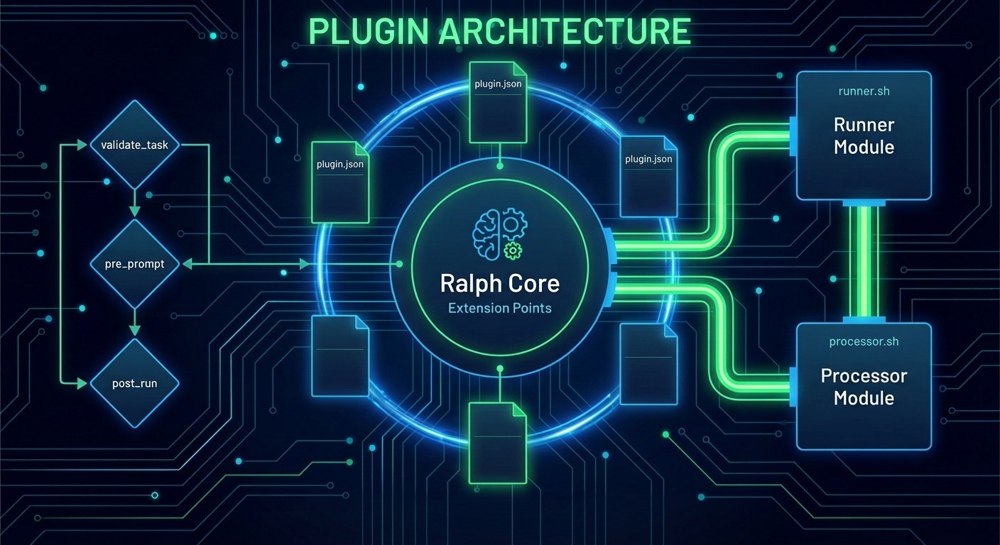

# Ralph Plugin System
Status: Active
Owner: Maintainers
Source of truth: this document for its stated scope
Parent: [Feature Documentation](README.md)




Purpose: Comprehensive documentation for Ralph's plugin system, enabling custom runners and task processors.

---

## Table of Contents

1. [Overview](#overview)
2. [Plugin Structure](#plugin-structure)
3. [Runner Plugins](#runner-plugins)
4. [Processor Plugins](#processor-plugins)
5. [Configuration](#configuration)
6. [Plugin Management](#plugin-management)
7. [Security Considerations](#security-considerations)
8. [Example Plugins](#example-plugins)
9. [Debugging](#debugging)
10. [API Version Compatibility](#api-version-compatibility)

---

## Overview

Ralph's plugin system allows extending the tool with custom runners and task processors without modifying the core codebase. Plugins enable:

- **Custom Runners**: Integrate with AI models or services not natively supported
- **Task Processors**: Hook into task lifecycle events for validation, transformation, and logging

### Plugin Types

| Type | Purpose | Execution Context |
|------|---------|-------------------|
| **Runner** | Execute prompts against custom AI backends | Primary task execution |
| **Processor** | Hook into task lifecycle events | Pre/post processing |

### Security Warning

> ⚠️ **CRITICAL**: Plugins are **NOT sandboxed**. Enabling a plugin grants it full system access equivalent to running arbitrary code. Only enable plugins from trusted sources.

---

## Plugin Structure

### Directory Layout

Plugins are discovered from two locations:

```
~/.config/ralph/plugins/          # Global plugins (all projects)
├── my.plugin/
│   ├── plugin.json               # Required: Plugin manifest
│   ├── runner.sh                 # Optional: Runner executable
│   └── processor.sh              # Optional: Processor executable

./.ralph/plugins/                  # Project plugins (override global)
├── my.plugin/
│   ├── plugin.json
│   ├── runner.sh
│   └── processor.sh
```

**Precedence Rule**: Project plugins override global plugins with the same ID.

### Plugin Manifest (`plugin.json`)

Every plugin requires a `plugin.json` manifest file:

```json
{
  "api_version": 1,
  "id": "my.plugin",
  "version": "1.0.0",
  "name": "My Plugin",
  "description": "A custom plugin for Ralph",
  "runner": {
    "bin": "runner.sh",
    "supports_resume": true,
    "default_model": "custom-model-v1"
  },
  "processors": {
    "bin": "processor.sh",
    "hooks": ["validate_task", "pre_prompt", "post_run"]
  }
}
```

### Manifest Field Reference

| Field | Required | Description |
|-------|----------|-------------|
| `api_version` | Yes | Must be `1` (current API version) |
| `id` | Yes | Unique identifier (no spaces, no path separators: `/` or `\`) |
| `version` | Yes | Semantic version (e.g., `1.0.0`) |
| `name` | Yes | Human-readable display name |
| `description` | No | Brief description of plugin functionality |
| `runner` | No | Runner configuration (required for runner plugins) |
| `runner.bin` | Yes* | Path to runner executable (relative to plugin directory) |
| `runner.supports_resume` | No | Whether runner supports session resumption (default: `false`) |
| `runner.default_model` | No | Default model when none is specified |
| `processors` | No | Processor configuration (required for processor plugins) |
| `processors.bin` | Yes* | Path to processor executable |
| `processors.hooks` | Yes* | Array of supported hooks: `validate_task`, `pre_prompt`, `post_run` |

\* Required if the parent section is present.

---

## Runner Plugins

Runner plugins execute prompts against custom AI backends. They must implement the runner protocol to communicate with Ralph.

### Runner Protocol

#### Run Command

```bash
<runner-bin> run --model <model-id> --output-format stream-json [--session <session-id>]
```

- **Arguments**:
  - `--model`: The model identifier to use
  - `--output-format`: Must be `stream-json`
  - `--session`: Optional session ID for resumable sessions

- **Stdin**: The prompt text

- **Stdout**: Newline-delimited JSON (NDJSON) stream

#### Resume Command (Optional)

Only required if `supports_resume` is `true` in the manifest:

```bash
<runner-bin> resume --session <session-id> --model <model-id> --output-format stream-json <message>
```

- **Arguments**:
  - `--session`: The session ID to resume
  - `--model`: The model identifier
  - `--output-format`: Must be `stream-json`
  - `<message>`: The resume message as final argument

### Environment Variables

Runners receive these environment variables:

| Variable | Description |
|----------|-------------|
| `RALPH_PLUGIN_ID` | The plugin ID (e.g., `my.plugin`) |
| `RALPH_PLUGIN_CONFIG_JSON` | Opaque plugin configuration as JSON string (`{}` if no config) |
| `RALPH_RUNNER_CLI_JSON` | Resolved runner CLI options (see below) |

### Resolved Runner CLI Options

The `RALPH_RUNNER_CLI_JSON` contains normalized CLI options:

```json
{
  "output_format": "stream_json",
  "verbosity": "normal",
  "approval_mode": "yolo",
  "sandbox": "default",
  "plan_mode": "default",
  "unsupported_option_policy": "warn"
}
```

### Expected Output Format

Runners MUST emit newline-delimited JSON (NDJSON). Each line is a separate JSON object.

#### Supported Output Types

Ralph parses and displays various JSON formats from runners:

**1. Claude Format (type=assistant)**
```json
{"type": "assistant", "message": {"role": "assistant", "content": [{"type": "text", "text": "Hello"}]}}
```

**2. Kimi Format (role=assistant)**
```json
{"role": "assistant", "content": [{"type": "text", "text": "Hello"}]}
```

**3. Codex Format (item.completed)**
```json
{"type": "item.completed", "item": {"type": "agent_message", "text": "Hello"}}
```

**4. Gemini Format (type=message)**
```json
{"type": "message", "role": "assistant", "content": "Hello"}
```

**5. Text Streaming (Opencode)**
```json
{"type": "text", "part": {"text": "Hello "}}
{"type": "text", "part": {"text": "World"}}
```

**6. Tool Calls**
```json
{"type": "tool_use", "tool_name": "write", "parameters": {"path": "file.txt", "content": "data"}}
```

**7. Session ID**
```json
{"type": "session", "id": "RQ-0001-p2-1704153600"}
```

### Session ID Extraction

Ralph extracts session IDs from various JSON fields for crash recovery:
- `id` (when `type` is `session`)
- `thread_id`
- `session_id`
- `sessionID`

**Session ID Format**: `{task_id}-p{phase}-{timestamp}`  
**Example**: `RQ-0001-p2-1704153600`

---

## Processor Plugins

Processor plugins hook into the task lifecycle for validation, transformation, and logging.

### Hook Types

| Hook | When Invoked | Input File Contents | Failure Behavior |
|------|--------------|---------------------|------------------|
| `validate_task` | After task selection, before marking `doing` | Full task JSON | Fatal - aborts run before work begins |
| `pre_prompt` | After prompt compilation, before runner | Prompt text | Fatal - aborts before spawning runner |
| `post_run` | After each successful runner execution | Runner stdout (NDJSON) | Fatal - aborts workflow at failure point |

**Important Notes on `post_run`**:
- Invoked after every successful runner `run` (normal execution)
- Invoked after each successful `resume` / Continue (CI gate enforcement)
- May run multiple times in a single overall task execution

### Hook Protocol

For each hook invocation:

```bash
<processor-bin> <HOOK> <TASK_ID> <FILEPATH>
```

- **Arguments**:
  1. `HOOK`: The hook name (`validate_task`, `pre_prompt`, `post_run`)
  2. `TASK_ID`: The task identifier (e.g., `RQ-0001`)
  3. `FILEPATH`: Path to temporary file containing hook-specific data

- **Working Directory**: Repository root

- **Environment Variables**:
  - `RALPH_PLUGIN_ID`: The plugin ID
  - `RALPH_PLUGIN_CONFIG_JSON`: Plugin config blob as JSON string

### Chaining Order

Enabled processor plugins are executed in **ascending lexicographic order** by `plugin_id`. This provides deterministic, predictable execution:

```
a.plugin → b.plugin → my.plugin → z.plugin
```

**Rationale**: Both discovery and config use `BTreeMap` keyed by ID; iteration order is stable.

### Exit Code Contract

| Exit Code | Meaning |
|-----------|---------|
| `0` | Success - continue to next plugin/proceed |
| Non-zero | Failure - abort with error message |

On non-zero exit, Ralph displays:
```
Processor hook failed: plugin=<id>, hook=<hook>, exit_code=<code>
stderr: <redacted stderr output>
```

### In-Place Modification

The `pre_prompt` hook can modify the prompt file in place. Ralph reads the file after all plugins complete and uses the modified content:

```bash
#!/bin/bash
HOOK=$1
TASK_ID=$2
FILE=$3

if [ "$HOOK" = "pre_prompt" ]; then
    # Append custom instructions
    echo -e "\n\nRemember to follow project conventions." >> "$FILE"
fi
exit 0
```

---

## Configuration

### Enabling Plugins

Plugins are **disabled by default** for security. Enable via configuration:

```json
{
  "version": 1,
  "plugins": {
    "plugins": {
      "my.plugin": {
        "enabled": true
      }
    }
  }
}
```

### Per-Plugin Configuration

Pass custom configuration to plugins:

```json
{
  "version": 1,
  "plugins": {
    "plugins": {
      "my.plugin": {
        "enabled": true,
        "config": {
          "api_key": "secret-key",
          "endpoint": "https://api.example.com",
          "timeout": 30
        }
      }
    }
  }
}
```

The config blob is passed via `RALPH_PLUGIN_CONFIG_JSON`:

```bash
#!/bin/bash
# Read plugin-specific configuration
CONFIG="$RALPH_PLUGIN_CONFIG_JSON"
API_KEY=$(echo "$CONFIG" | jq -r '.api_key // empty')
TIMEOUT=$(echo "$CONFIG" | jq -r '.timeout // 30')
```

### Binary Location

Runner and processor executable paths are defined in `plugin.json`, not in config. Use config only for enablement and plugin-specific data:

```json
{
  "plugins": {
    "plugins": {
      "my.plugin": {
        "enabled": true,
        "config": {
          "api_base_url": "https://api.example.com"
        }
      }
    }
  }
}
```

**Path Resolution**:
- Manifest `runner.bin` / `processors.bin` paths must be relative to the plugin directory
- Absolute paths are rejected
- Path escape (`..`) is rejected
- Existing symlinked files and ancestor directories must still canonicalize inside the plugin directory

---

## Plugin Management

### Scaffold a New Plugin

Create a new plugin with the scaffold command:

```bash
# Scaffold with both runner and processor (default)
ralph plugin init my.plugin

# Scaffold with only runner support
ralph plugin init my.plugin --with-runner

# Scaffold with only processor support
ralph plugin init my.plugin --with-processor

# Scaffold in global scope
ralph plugin init my.plugin --scope global

# Preview what would be created
ralph plugin init my.plugin --dry-run
```

This creates:
- `plugin.json`: Valid manifest that passes validation
- `runner.sh`: Runner stub (if requested)
- `processor.sh`: Processor stub (if requested)

### Install a Plugin

Install from a local directory:

```bash
# Install to project scope
ralph plugin install ./my-plugin --scope project

# Install to global scope
ralph plugin install ./my-plugin --scope global
```

**Note**: Install does NOT auto-enable the plugin. Enable manually in config for security.

### List Plugins

```bash
# List discovered plugins
ralph plugin list

# List as JSON
ralph plugin list --json
```

### Validate Plugins

```bash
# Validate all discovered plugins
ralph plugin validate

# Validate specific plugin
ralph plugin validate --id my.plugin
```

Validation checks:
- `api_version` matches current supported version
- Plugin ID is valid (non-empty, no path separators)
- Required fields are present
- Hook names are supported

### Uninstall a Plugin

```bash
# Uninstall from project scope
ralph plugin uninstall my.plugin --scope project

# Uninstall from global scope
ralph plugin uninstall my.plugin --scope global
```

---

## Security Considerations

### ⚠️ Plugins Are NOT Sandboxed

Enabling a plugin is equivalent to trusting it with full system access. Plugins can:
- Execute arbitrary commands
- Access files and environment variables
- Make network requests
- Modify the repository

### Security Best Practices

1. **Review Before Enabling**
   ```bash
   # Read plugin code before enabling
   cat .ralph/plugins/suspicious.plugin/runner.sh
   
   # Validate the manifest
   ralph plugin validate --id suspicious.plugin
   ```

2. **Explicit Enable Required**
   - Plugins must be explicitly enabled in config
   - Discovery alone does not activate plugins
   - Default state is `enabled: false`

3. **Project vs Global Scope**
   - Project plugins override global plugins
   - Project-scope plugins are runtime-active only in trusted repos; untrusted repos ignore `.ralph/plugins/*`
   - Review `.ralph/plugins/` in repositories you clone

4. **Binary Path Security**
   - Manifest paths cannot escape the plugin directory (`..` is rejected)
   - Absolute manifest paths are rejected
   - Existing symlinked files and ancestor directories must still canonicalize inside the plugin directory
   - Config-level runner/processor binary overrides are not supported

5. **Environment Variable Redaction**
   - Ralph redacts sensitive content from plugin stderr before display
   - Secrets in `RALPH_PLUGIN_CONFIG_JSON` are handled securely
   - Never log the full config blob in plugin code

---

## Example Plugins

### Example 1: Custom Runner Plugin

A runner that forwards prompts to a custom HTTP API:

**Directory Structure:**
```
~/.config/ralph/plugins/custom-api/
├── plugin.json
└── runner.sh
```

**plugin.json:**
```json
{
  "api_version": 1,
  "id": "custom.api",
  "version": "1.0.0",
  "name": "Custom API Runner",
  "description": "Forwards prompts to custom HTTP API",
  "runner": {
    "bin": "runner.sh",
    "supports_resume": false,
    "default_model": "gpt-4"
  }
}
```

**runner.sh:**
```bash
#!/bin/bash
# runner.sh - Custom API runner example

set -e

# Parse arguments
COMMAND=""
MODEL=""
OUTPUT_FORMAT=""
SESSION_ID=""

while [[ $# -gt 0 ]]; do
    case $1 in
        run|resume)
            COMMAND="$1"
            shift
            ;;
        --model)
            MODEL="$2"
            shift 2
            ;;
        --output-format)
            OUTPUT_FORMAT="$2"
            shift 2
            ;;
        --session)
            SESSION_ID="$2"
            shift 2
            ;;
        *)
            shift
            ;;
    esac
done

# Read config
API_ENDPOINT=$(echo "$RALPH_PLUGIN_CONFIG_JSON" | jq -r '.endpoint // "https://api.example.com/v1"')
API_KEY=$(echo "$RALPH_PLUGIN_CONFIG_JSON" | jq -r '.api_key // empty')

# Read prompt from stdin
PROMPT=$(cat)

# Output session marker (optional)
if [ -n "$SESSION_ID" ]; then
    echo '{"type": "session", "id": "'$SESSION_ID'"}'
fi

# Call API and stream response
# This is a simplified example - implement proper error handling
RESPONSE=$(curl -s -X POST "$API_ENDPOINT/chat" \
    -H "Authorization: Bearer $API_KEY" \
    -H "Content-Type: application/json" \
    -d "{\"model\": \"$MODEL\", \"messages\": [{\"role\": \"user\", \"content\": $(echo "$PROMPT" | jq -R -s .)}]}")

# Extract and output response
CONTENT=$(echo "$RESPONSE" | jq -r '.choices[0].message.content // empty')
if [ -n "$CONTENT" ]; then
    # Output in Kimi-compatible format
    echo '{"role": "assistant", "content": [{"type": "text", "text": "'$CONTENT'"}]}'
fi

# Output finish marker
echo '{"type": "finish", "session_id": "'$SESSION_ID'"}'
```

**Enable and Configure:**
```json
{
  "version": 1,
  "plugins": {
    "plugins": {
      "custom.api": {
        "enabled": true,
        "config": {
          "endpoint": "https://my-api.example.com/v1",
          "api_key": "sk-..."
        }
      }
    }
  }
}
```

### Example 2: Task Validation Processor

A processor that enforces task conventions:

**Directory Structure:**
```
~/.config/ralph/plugins/task-validator/
├── plugin.json
└── processor.sh
```

**plugin.json:**
```json
{
  "api_version": 1,
  "id": "validator.task",
  "version": "1.0.0",
  "name": "Task Validator",
  "description": "Validates task structure before execution",
  "processors": {
    "bin": "processor.sh",
    "hooks": ["validate_task"]
  }
}
```

**processor.sh:**
```bash
#!/bin/bash
# processor.sh - Task validation example

HOOK="$1"
TASK_ID="$2"
FILE="$3"

case "$HOOK" in
    validate_task)
        # Read task JSON
        TASK_JSON=$(cat "$FILE")
        
        # Extract fields
        TITLE=$(echo "$TASK_JSON" | jq -r '.title // empty')
        SCOPE=$(echo "$TASK_JSON" | jq -r '.scope // empty')
        
        # Validate: Title must not be empty
        if [ -z "$TITLE" ]; then
            echo "Error: Task $TASK_ID has no title" >&2
            exit 1
        fi
        
        # Validate: Scope must be defined
        if [ -z "$SCOPE" ] || [ "$SCOPE" = "[]" ] || [ "$SCOPE" = "null" ]; then
            echo "Error: Task $TASK_ID must have scope defined" >&2
            exit 1
        fi
        
        # Validate: Title should follow convention (e.g., start with verb)
        if ! echo "$TITLE" | grep -qiE '^(Add|Fix|Update|Remove|Refactor|Implement)'; then
            echo "Warning: Task $TASK_ID title should start with a verb (Add/Fix/Update/Remove/Refactor/Implement)" >&2
            # Don't exit 1 for warnings, just warn
        fi
        
        echo "Task $TASK_ID validated successfully"
        ;;
    
    *)
        # Unknown hook - ignore
        ;;
esac

exit 0
```

### Example 3: Pre-Prompt Enhancement

A processor that adds context to prompts:

**plugin.json:**
```json
{
  "api_version": 1,
  "id": "enhancer.context",
  "version": "1.0.0",
  "name": "Context Enhancer",
  "description": "Adds repository context to prompts",
  "processors": {
    "bin": "enhancer.sh",
    "hooks": ["pre_prompt"]
  }
}
```

**enhancer.sh:**
```bash
#!/bin/bash
# enhancer.sh - Add context to prompts

HOOK="$1"
TASK_ID="$2"
FILE="$3"

if [ "$HOOK" = "pre_prompt" ]; then
    # Get repository info
    BRANCH=$(git branch --show-current 2>/dev/null || echo "unknown")
    RECENT_COMMITS=$(git log --oneline -5 2>/dev/null || echo "No recent commits")
    
    # Read config for custom rules
    RULES=$(echo "$RALPH_PLUGIN_CONFIG_JSON" | jq -r '.rules // empty')
    
    # Append context to prompt
    cat >> "$FILE" << EOF

---
Repository Context:
- Current Branch: $BRANCH
- Recent Commits:
$RECENT_COMMITS

Coding Rules:
$RULES
EOF
fi

exit 0
```

### Example 4: Post-Run Logger

A processor that logs task completions:

**plugin.json:**
```json
{
  "api_version": 1,
  "id": "logger.completion",
  "version": "1.0.0",
  "name": "Completion Logger",
  "description": "Logs task completions to a file",
  "processors": {
    "bin": "logger.sh",
    "hooks": ["post_run"]
  }
}
```

**logger.sh:**
```bash
#!/bin/bash
# logger.sh - Log task completions

HOOK="$1"
TASK_ID="$2"
FILE="$3"

if [ "$HOOK" = "post_run" ]; then
    # Get log path from config
    LOG_PATH=$(echo "$RALPH_PLUGIN_CONFIG_JSON" | jq -r '.log_path // ".ralph/task-log.txt"')
    
    # Create log entry
    TIMESTAMP=$(date -Iseconds)
    REPO=$(basename "$(git rev-parse --show-toplevel 2>/dev/null || echo 'unknown')")
    
    echo "[$TIMESTAMP] Task $TASK_ID completed in $REPO" >> "$LOG_PATH"
    
    # Count tool calls from stdout (simplified)
    TOOL_COUNT=$(grep -c '"type": "tool_use"' "$FILE" 2>/dev/null || echo "0")
    echo "  - Tool calls: $TOOL_COUNT" >> "$LOG_PATH"
fi

exit 0
```

**Configuration:**
```json
{
  "plugins": {
    "plugins": {
      "logger.completion": {
        "enabled": true,
        "config": {
          "log_path": "~/.ralph/task-completions.log"
        }
      }
    }
  }
}
```

---

## Debugging

### Enable Verbose Logging

```bash
# See plugin discovery and execution details
RUST_LOG=debug ralph plugin list

# See full execution trace
RUST_LOG=trace ralph run one
```

### Check Plugin Discovery

```bash
# Show discovered plugins and their locations
ralph plugin list

# Output as JSON for programmatic inspection
ralph plugin list --json
```

### Inspect Environment Variables

Create a debug script to see what Ralph passes:

**debug.sh:**
```bash
#!/bin/bash
echo "=== Plugin Environment ===" > /tmp/ralph_plugin_debug.log
echo "RALPH_PLUGIN_ID: $RALPH_PLUGIN_ID" >> /tmp/ralph_plugin_debug.log
echo "RALPH_PLUGIN_CONFIG_JSON: $RALPH_PLUGIN_CONFIG_JSON" >> /tmp/ralph_plugin_debug.log
echo "RALPH_RUNNER_CLI_JSON: $RALPH_RUNNER_CLI_JSON" >> /tmp/ralph_plugin_debug.log
echo "Arguments: $*" >> /tmp/ralph_plugin_debug.log
echo "Working Directory: $(pwd)" >> /tmp/ralph_plugin_debug.log
echo "=========================" >> /tmp/ralph_plugin_debug.log
```

### Test Runner Protocol Manually

```bash
# Test run command
echo "Hello, AI!" | ./my-runner.sh run --model gpt-4 --output-format stream-json

# Test with session
echo "Hello!" | ./my-runner.sh run --model gpt-4 --output-format stream-json --session test-123

# Test resume
./my-runner.sh resume --session test-123 --model gpt-4 --output-format stream-json "Continue please"
```

### Validate Plugin Manifest

```bash
# Check manifest syntax and validity
ralph plugin validate --id my.plugin

# If validation fails, check:
# - api_version is 1
# - id has no spaces or path separators
# - hooks are valid: validate_task, pre_prompt, post_run
```

### Common Issues

**Plugin not discovered:**
- Verify directory structure: `<plugin_root>/<plugin_id>/plugin.json`
- Check file permissions (executable bit on Unix)
- Run `ralph plugin list` to see searched directories

**Plugin not executing:**
- Verify plugin is enabled: `plugins.plugins.<id>.enabled: true`
- Check the executable exists and is executable
- Look at stderr output for error messages
- Enable debug logging: `RUST_LOG=debug`

**Runner not found:**
- Verify `runner.bin` path in manifest
- Path must stay relative to the plugin directory and remain inside it after canonical path resolution
- Config-level runner/processor binary overrides are not supported

**Processor hook failing:**
- Check exit code in error message
- Review stderr output (redacted for secrets)
- Test processor script manually with sample input

---

## API Version Compatibility

### Current API Version

The current plugin API version is **`1`**.

Ralph rejects plugins with incompatible API versions:

```
Error: plugin api_version mismatch: got 2, expected 1
```

### Compatibility Guarantees

| API Version | Ralph Versions | Status |
|-------------|----------------|--------|
| 1 | Current | ✅ Supported |

### Migration Notes

When Ralph updates to API version 2:
- Existing plugins with `api_version: 1` will need updates
- Breaking changes will be documented in release notes
- Migration guides will be provided for common patterns

### Version Detection

Plugins can check the API version at runtime via environment or by checking Ralph's version:

```bash
#!/bin/bash
# Check if running on compatible Ralph version
RALPH_VERSION=$(ralph --version 2>/dev/null | grep -oE '[0-9]+\.[0-9]+\.[0-9]+' | head -1)
echo "Running on Ralph $RALPH_VERSION"
```

---

## Best Practices

### Plugin Development

1. **Use Semantic Versioning** for plugin versions
2. **Handle Missing Config Gracefully** - `RALPH_PLUGIN_CONFIG_JSON` may be `{}`
3. **Exit Codes Matter** - Non-zero exit codes are treated as failures
4. **Idempotent Operations** - Runner resume should be idempotent
5. **Document Your Config** - Include expected config fields in plugin README

### Runner Best Practices

1. **Stream Output** - Don't buffer entire response; stream JSON lines
2. **Handle Interruptions** - Respond to SIGTERM gracefully
3. **Timeout Handling** - Respect timeout configuration
4. **Error Format** - Output errors as JSON when possible:
   ```json
   {"type": "error", "message": "Connection failed"}
   ```

### Processor Best Practices

1. **Fail Fast** - Validate early and exit non-zero on issues
2. **Minimal Modifications** - Only modify what's necessary (especially `pre_prompt`)
3. **Clear Error Messages** - Write actionable errors to stderr
4. **Respect Chaining** - Don't assume you're the only processor running

---

## See Also

- [Plugin Development Guide](../plugin-development.md) - Guide for developing custom plugins
- [Configuration](../configuration.md) - Full configuration reference including plugin settings
- [CLI Reference](../cli.md) - Plugin management commands
