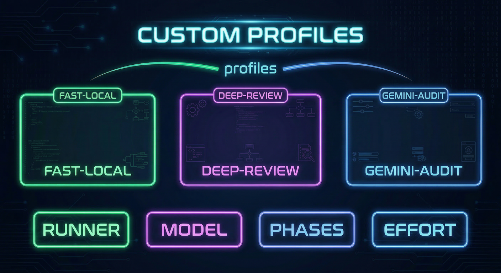

# Ralph Configuration Profiles
Status: Active
Owner: Maintainers
Source of truth: this document for its stated scope
Parent: [Feature Documentation](README.md)




Purpose: Document Ralph's configuration profiles feature for quick workflow switching between named `agent` presets.

---

## Overview

Configuration profiles let you name a reusable `agent` patch and apply it with `--profile <NAME>`.

Profiles are:
- Defined under the `profiles` key in `.ralph/config.jsonc` or `~/.config/ralph/config.jsonc` (your profiles are additive patches on top of base `agent` settings)
- Applied before CLI overrides are resolved
- Useful for standardizing repeatable workflows without typing many flags each time

Ralph ships two **built-in** reserved profiles, `safe` and `power-user`, that always apply their own safety and git-publish defaults. You cannot redefine those names in config; add separate custom profile names instead (for example `quick` or `thorough`).

## Built-in profiles

| Name | Purpose (summary) |
|------|-------------------|
| `safe` | Stricter runner approvals, conservative Claude permissions, git publish off |
| `power-user` | Permissive runner approvals, Claude bypass permissions, commit and push after success |

Use `ralph config profiles list` to see the effective one-line summary for each name, including built-ins.

## Example Profiles

```jsonc
{
  "version": 2,
  "agent": {
    "runner": "codex",
    "model": "gpt-5.4",
    "phases": 2
  },
  "profiles": {
    "fast-local": {
      "phases": 1,
      "reasoning_effort": "low"
    },
    "deep-review": {
      "phases": 3,
      "reasoning_effort": "high"
    },
    "gemini-audit": {
      "runner": "gemini",
      "model": "gemini-3-pro-preview",
      "phases": 3
    }
  }
}
```

Common patterns:
- `fast-local`: quick single-pass runs
- `deep-review`: full plan/implement/review flow
- `gemini-audit`: alternate runner for a specific class of scans

## Using Profiles

```bash
# Run one task with a configured profile
ralph run one --profile fast-local

# Scan with a deeper profile
ralph scan --profile deep-review "security audit"

# Override profile settings for one invocation
ralph run one --profile fast-local --phases 2 --runner claude

# Inspect configured profiles
ralph config profiles list
ralph config profiles show fast-local
```

## Precedence and Inheritance

When a profile is selected, Ralph resolves settings in this order:

1. CLI flags
2. Task overrides (`task.agent.*`)
3. Selected profile
4. Base config

Profile patches use the same leaf-wise merge rules as the rest of config:
- fields you set in the profile override base config
- fields you omit inherit from base config

That means a profile can stay small:

```jsonc
{
  "profiles": {
    "fast-local": {
      "phases": 1
    }
  }
}
```

## Recreating Old Names

If your team still wants `quick` or `thorough`, define them directly (these are custom names, not reserved):

```jsonc
{
  "profiles": {
    "quick": {
      "runner": "codex",
      "model": "gpt-5.4",
      "phases": 1,
      "reasoning_effort": "low"
    },
    "thorough": {
      "runner": "codex",
      "model": "gpt-5.4",
      "phases": 3,
      "reasoning_effort": "high"
    }
  }
}
```

This is a normal custom-profile pattern layered on top of base `agent` settings.

## Troubleshooting

- `Unknown profile`: the selected name is not defined in your config and is not a built-in name. Run `ralph config profiles list` to confirm what exists.
- `No profiles configured`: you have no `profiles` object in config; built-in `safe` and `power-user` are still listed by `ralph config profiles list`.
- Need one-off changes: keep the profile small and override the rest with CLI flags.
