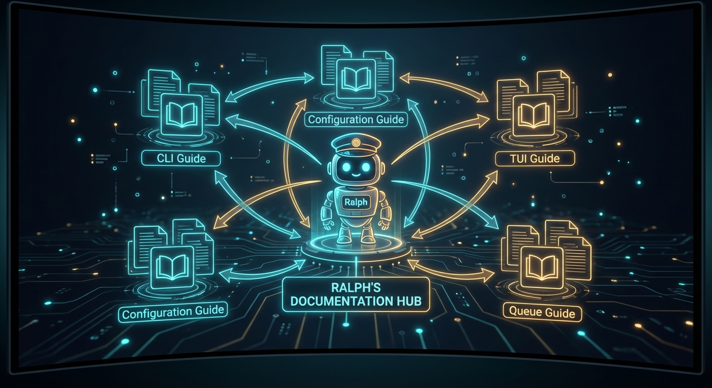

# Ralph Documentation

> **Ralph** is a Rust CLI for running AI agent loops against a structured JSON task queue.
> On macOS, Ralph also includes a SwiftUI app for interactive queue work (`ralph app open`).



---

## 📚 Documentation by User Type

Choose your path:

| User Type | Start Here | Goal |
|-----------|------------|------|
| **New User** | [Quick Start Guide](#start-here) | Get Ralph installed and running your first task |
| **Daily User** | [Core Concepts](#core-concepts) → [App Guide](#workflow-tools) | Efficient daily task management |
| **Power User** | [Parallel Execution](#execution-features) → [Webhooks](#integration-features) | Scale and integrate Ralph |
| **Contributor** | [Contributing Guide](#contributing) → [Error Handling](#development-reference) | Extend and improve Ralph |

---

## Start Here

New to Ralph? Start with these essential guides:

| Document | Description | Time |
|----------|-------------|------|
| **[Quick Start Guide](quick-start.md)** | Install Ralph, initialize your project, and run your first task | 5 min |
| **[CLI Reference](cli.md)** | Complete command-line documentation with examples | Reference |
| **[Configuration](configuration.md)** | Full configuration reference and examples | 10 min |

### First Steps

```bash
# 1. Install Ralph
cargo install ralph

# 2. Initialize your project
ralph init

# 3. Run the next task
ralph run one

# macOS (optional): open the app UI
ralph app open
```

---

## Installation & Setup

### Installation Methods

| Method | Command | Best For |
|--------|---------|----------|
| From crates.io | `cargo install ralph` | Most users |
| From source | `make install` | Contributors, cutting edge |

### Initial Setup

| Document | Description |
|----------|-------------|
| **[Quick Start](quick-start.md)** | Step-by-step initialization and first run |
| **[Configuration](configuration.md)** | Config file format, locations, and options |
| **[Environment Variables](environment.md)** | Environment variables that affect behavior |

### Configuration Files

Ralph reads configuration from two locations (project config overrides global):

- **Global**: `~/.config/ralph/config.json`
- **Project**: `.ralph/config.json`

See [Configuration Precedence](configuration.md#precedence) for details.

---

## Core Concepts

Understanding Ralph's fundamental building blocks:

### The Task Queue

| Document | Description |
|----------|-------------|
| **[Queue and Tasks](queue-and-tasks.md)** | Task structure, fields, and lifecycle |
| **[Features: Queue](features/queue.md)** | Queue operations and management |
| **[Features: Dependencies](features/dependencies.md)** | Task relationships and execution ordering |

### Execution Model

| Document | Description |
|----------|-------------|
| **[Workflow](workflow.md)** | High-level runtime layout and phases |
| **[Features: Phases](features/phases.md)** | Multi-phase execution (Plan → Implement → Review) |
| **[Features: Runners](features/runners.md)** | AI runner orchestration (Claude, Codex, Kimi, etc.) |
| **[Features: Session Management](features/session-management.md)** | Crash recovery and session resumption |

### Context & Planning

| Document | Description |
|----------|-------------|
| **[Features: Context](features/context.md)** | RepoPrompt integration and context building |
| **[ralph context](cli.md#ralph-context)** | Managing AGENTS.md for AI agents |

---

## Feature Documentation

Detailed guides for Ralph's capabilities, organized by category:

### Core Concepts

| Feature | Document | Description |
|---------|----------|-------------|
| Phases | [features/phases.md](features/phases.md) | 1/2/3-phase execution workflows |
| Queue | [features/queue.md](features/queue.md) | Task queue management and lifecycle |
| Dependencies | [features/dependencies.md](features/dependencies.md) | Task relationships and DAG execution |
| Context | [features/context.md](features/context.md) | RepoPrompt integration |

### Execution Features

| Feature | Document | Description |
|---------|----------|-------------|
| Runners | [features/runners.md](features/runners.md) | AI runner orchestration |
| Parallel | [features/parallel.md](features/parallel.md) | Parallel task execution with PR automation |
| Session Management | [features/session-management.md](features/session-management.md) | Crash recovery and resumption |
| Supervision | [features/phases.md](features/phases.md) | Human-in-the-loop review |

### Workflow Tools

| Feature | Document | Description |
|---------|----------|-------------|
| App (macOS) | [features/app.md](features/app.md) | macOS SwiftUI app |
| Scan | [features/scan.md](features/scan.md) | AI-powered repository scanning |
| Daemon & Watch | [features/daemon-and-watch.md](features/daemon-and-watch.md) | Background execution and file watching |

### Integration Features

| Feature | Document | Description |
|---------|----------|-------------|
| Webhooks | [features/webhooks.md](features/webhooks.md) | HTTP event notifications |
| Plugins | [features/plugins.md](features/plugins.md) | Custom runner and processor plugins |
| Notifications | [features/notifications.md](features/notifications.md) | Desktop notifications and sounds |
| Import/Export | [features/import-export.md](features/import-export.md) | Queue import/export workflows |

### Configuration Features

| Feature | Document | Description |
|---------|----------|-------------|
| Configuration | [features/configuration.md](features/configuration.md) | Feature-specific configuration |
| Profiles | [features/profiles.md](features/profiles.md) | Workflow presets and quick switching |
| Prompts | [features/prompts.md](features/prompts.md) | Custom prompt templates |
| Migrations | [features/migrations.md](features/migrations.md) | Config and data migration |

### Security Features

| Feature | Document | Description |
|---------|----------|-------------|
| Security | [features/security.md](features/security.md) | Security features and configuration |
| [SECURITY.md](../SECURITY.md) | Root-level doc | Security policy and vulnerability reporting |

---

## Guides

Step-by-step tutorials for common workflows:

### Getting Started

| Guide | Description |
|-------|-------------|
| [Quick Start](quick-start.md) | Get up and running in minutes |
| [Your First Task](quick-start.md#your-first-task) | Creating and running your first task |
| [Understanding Phases](quick-start.md#understanding-the-3-phase-workflow) | 1-phase vs 2-phase vs 3-phase |

### Daily Workflows

| Guide | Description |
|-------|-------------|
| [Daily Development](quick-start.md#daily-development) | CLI + macOS app workflow for everyday use |
| [Creating Tasks](quick-start.md#creating-tasks) | From CLI and macOS app |
| [Queue Management](queue-and-tasks.md) | Managing the task queue |

### Advanced Workflows

| Guide | Document |
|-------|----------|
| Parallel Execution | [features/parallel.md](features/parallel.md) |
| Repository Scanning | [features/scan.md](features/scan.md) |
| Webhook Integration | [features/webhooks.md](features/webhooks.md) |
| Plugin Development | [plugin-development.md](plugin-development.md) |

### Use Case Guides

| I want to... | See |
|--------------|-----|
| Get started quickly | [Quick Start](quick-start.md), [App](features/app.md) |
| Configure my runner | [Runners](features/runners.md), [Configuration](configuration.md) |
| Set up parallel execution | [Parallel](features/parallel.md) |
| Integrate with Slack/Discord | [Webhooks](features/webhooks.md) |
| Automate task detection | [Daemon and Watch](features/daemon-and-watch.md), [Scan](features/scan.md) |
| Handle failures and recovery | [Session Management](features/session-management.md) |
| Manage task dependencies | [Dependencies](features/dependencies.md) |
| Customize prompts | [Prompts](features/prompts.md) |
| Migrate configurations | [Migrations](features/migrations.md) |

---

## Reference

Complete reference documentation:

### CLI Reference

| Document | Description |
|----------|-------------|
| **[CLI Reference](cli.md)** | Complete command-line documentation |
| [Global Flags](cli.md#global-flags) | Flags available on all commands |
| [ralph init](cli.md#ralph-init) | Bootstrap Ralph in a repository |
| [ralph run](cli.md#ralph-run) | Run tasks |
| [ralph queue](cli.md#ralph-queue) | Queue management |
| [ralph task](cli.md#ralph-task) | Task creation and management |
| [ralph app](cli.md#ralph-app) | macOS app integration |
| [ralph scan](cli.md#ralph-scan) | Repository scanning |
| [ralph config](cli.md#ralph-config) | Configuration inspection |
| [ralph doctor](cli.md#ralph-doctor) | Environment verification |
| [ralph undo](cli.md#ralph-undo) | Undo queue operations |
| [ralph daemon](cli.md#ralph-daemon) | Background daemon management |
| [ralph context](cli.md#ralph-context) | AGENTS.md management |
| [ralph webhook](cli.md#ralph-webhook) | Webhook testing, diagnostics, and replay |
| [ralph completions](cli.md#ralph-completions) | Shell completions |

### Configuration Reference

| Document | Description |
|----------|-------------|
| **[Configuration](configuration.md)** | Full configuration reference |
| [Agent Config](configuration.md#agent-configuration) | Runner, model, phases, CI gate |
| [Parallel Config](configuration.md#parallel-configuration) | Parallel execution settings |
| [Queue Config](configuration.md#queue-configuration) | Queue file locations and aging |
| [Notification Config](configuration.md#notification-configuration) | Desktop notifications |
| [Webhook Config](configuration.md#webhook-configuration) | Webhook settings |
| [Plugin Config](configuration.md#plugin-configuration) | Plugin settings |
| [Profiles](configuration.md#profiles) | Configuration profiles |

### Schema Reference

| Schema | Location | Description |
|--------|----------|-------------|
| Config Schema | `schemas/config.schema.json` | Configuration validation schema |
| Queue Schema | `schemas/queue.schema.json` | Queue and task validation schema |

### Development Reference

| Document | Description |
|----------|-------------|
| **[Error Handling](error-handling.md)** | Error handling patterns for contributors |
| **[Environment Variables](environment.md)** | Environment variables reference |
| **[Plugin Development](plugin-development.md)** | Creating custom plugins |
| **[Workflow](workflow.md)** | Architecture and runtime layout |

---

## Contributing

Guides for contributing to Ralph:

| Document | Description |
|----------|-------------|
| **[CONTRIBUTING.md](../CONTRIBUTING.md)** | Contribution guidelines and workflow |
| **[AGENTS.md](../AGENTS.md)** | Repository guidelines for agents |
| [Error Handling](error-handling.md) | Patterns for contributors |
| [Plugin Development](plugin-development.md) | Extending Ralph with plugins |

### Development Workflow

```bash
# Local development cycle
cargo test -p ralph
cargo run -p ralph -- <command>

# Before committing (REQUIRED)
make ci
```

### Key Locations

| Location | Purpose |
|----------|---------|
| `crates/ralph/src/` | CLI commands, runner integration, queue management |
| `crates/ralph/assets/prompts/` | Embedded prompt templates |
| `crates/ralph/tests/` | Integration tests |
| `docs/` | Documentation |
| `schemas/` | JSON schemas |

---

## Runtime Files Reference

Ralph creates and manages these files in your repository:

### Source of Truth

| File | Purpose |
|------|---------|
| `.ralph/queue.json` | Active tasks (source of truth) |
| `.ralph/done.json` | Archive of completed tasks |
| `.ralph/config.json` | Project-level configuration |

### Prompt Overrides

Optional prompt overrides (defaults are embedded in the binary):

| File | Purpose |
|------|---------|
| `.ralph/prompts/worker.md` | Base worker prompt |
| `.ralph/prompts/worker_phase1.md` | Phase 1 planning wrapper |
| `.ralph/prompts/worker_phase2.md` | Phase 2 implementation wrapper |
| `.ralph/prompts/worker_phase3.md` | Phase 3 review wrapper |
| `.ralph/prompts/task_builder.md` | Task creation prompt |
| `.ralph/prompts/scan.md` | Repository scanning prompt |

### Cache and State

| File | Purpose |
|------|---------|
| `.ralph/cache/plans/<TASK_ID>.md` | Phase 1 cached plans |
| `.ralph/cache/completions/<TASK_ID>.json` | Task completion signals |
| `.ralph/cache/parallel/state.json` | Parallel run state |
| `.ralph/cache/session.json` | Session state for crash recovery |

---

## Troubleshooting

| Issue | Solution |
|-------|----------|
| `"ralph: command not found"` | Add `~/.local/bin` to PATH |
| `make ci` failing | Run `make ci`, fix first failing step |
| Queue lock issues | `ralph queue unlock` or `--force` |
| `.env tracked` error | `git rm --cached .env` |
| Runner not found | Check `ralph doctor`, verify PATH |
| Coverage not generating | Install `cargo-llvm-cov` and `llvm-tools-preview` component |

### Diagnostics

```bash
# Verify environment
ralph doctor

# Check queue validity
ralph queue validate

# Test webhook configuration
ralph webhook test

# Generate coverage report
make coverage

# Clean coverage artifacts
make coverage-clean
```

---

## Additional Resources

| Resource | Location |
|----------|----------|
| Changelog | [CHANGELOG.md](../CHANGELOG.md) |
| Security Policy | [SECURITY.md](../SECURITY.md) |
| Code of Conduct | [CODE_OF_CONDUCT.md](../CODE_OF_CONDUCT.md) |
| License | [LICENSE](../LICENSE) |

---

## Documentation Maintenance

When adding new features or updating existing ones:

1. Update the relevant feature document in `docs/features/`
2. Update this index if adding a new feature category
3. Update [features/README.md](features/README.md) with any new features
4. Run `make ci` to validate documentation links

---

*For detailed contributor guidelines, see [CONTRIBUTING.md](../CONTRIBUTING.md). For fast-path guidelines, see [AGENTS.md](../AGENTS.md).*
